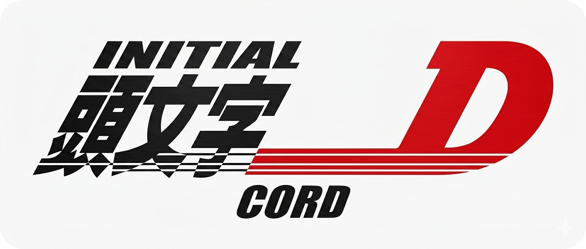

  
  
  # Initial Dcord
  *Initial D themed Discord skin, built on ClearVision v7.*
  
  

## Installation

Works with BetterDiscord and Vencord.

**Vencord**: Drop `initial-dcord.theme.css` into your Vencord `themes` folder and enable it in settings.

**BetterDiscord**: Open Discord Settings > Themes > Open Theme Folder. Drop the CSS file in there and enable it.

## What it does

- ClearVision v7 base with an Initial D/AE86 background
- Hover animations on servers and channels (GPU-composited, no layout thrashing)
- Dark translucent chat cards
- Thread/spine alignment fixes

## Credits

Based on [ClearVision-v7](https://github.com/ClearVision/ClearVision-v7). Background GIF by [1eni1 on DeviantArt](https://www.deviantart.com/1eni1/art/AE-86-819891459).

MIT License.
